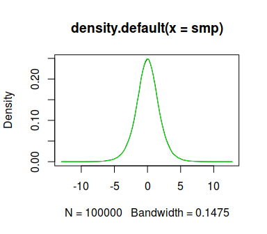

SCMC - Stochastic Collocation Monte Carlo
================

This is a development version of the `scmc` package for the R
programming language.

## Installation

The package isn’t available on CRAN so the only way to install the
package is to use the `devtools` package and run

``` r
devtools::install_github("blaza/scmc")
```

## Usage

The main function currently implemented is `univariate_sampler` which is
a flexible implementation of the method (and thus with a bit more
complicated interface) for generating univariate distributions. We’ll
cover here a couple of basic examples which give an overall picture of
the package capabilities.

### Example: Logistic distribution

We’ll generate variates from the [Logistic
distribution](https://en.wikipedia.org/wiki/Logistic_distribution).

The SCMC method implies interpolating , where  is
the target random variable and  is a random variable which can be
efficiently generated, and generating the samples  using
the formula , where  are variates from the
 distribution. In this example we’ll use the standard normal variable
. By default, we use the `RcppZiggurat::zrnorm` function to generate
normal variates.

The code to generate the Logistic distribution in the `scmc` package is

``` r
library(scmc)
# create the sampler
sampler <- univariate_sampler(qlogis, gaussian_nodes(7))
```

    ## Loading required package: RcppZiggurat

``` r
# generate 10000 random variates
smp <- sampler(1e5)
```

In its basic form, the `univariate_sampler` function requires the
inverse  (i.e. the quantile function of ) as the first
argument, and the nodes for the interpolation. In cases where normally
distributed  are used, optimal nodes for interpolation are the nodes
of the Gaussian quadrature with respect to the weight function 
(density of ). The third argument to `univariate_sampler` is `xdist`
which is by default `"norm"`, indicating the standard normal
distribution.

The quality of the generated sample can be visualized with it’s density

``` r
# plot the sample density
plot(density(smp))

# add a plot of the theoretical logistic density
curve(dlogis(x), add = TRUE, col = "green")
```

<!-- -->

The curves are nearly the same, so the approximation is good.
