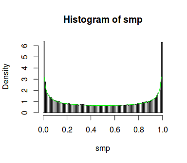

SCMC - Stochastic Collocation Monte Carlo
================

This is a development version of the `scmc` package for the R
programming language.

## Installation

The package isn’t available on CRAN so the only way to install the
package is to use the `devtools` package and run

``` r
devtools::install_github("blaza/scmc")
```

## Usage

The main function currently implemented is `univariate_sampler` which is
a flexible implementation of the method (and thus with a bit more
complicated interface) for generating univariate distributions. We’ll
cover here a couple of basic examples which give an overall picture of
the package capabilities.

### Example: Logistic distribution

We’ll generate variates from the [Logistic
distribution](https://en.wikipedia.org/wiki/Logistic_distribution).

The SCMC method implies interpolating $F_Y^{-1}(F_X(x))$, where $Y$
is the target random variable and $X$ is a random variable which can
be efficiently generated, and generating the samples
$y_i,\ i=1,\dots,n$ using the formula $y_i = F_Y^{-1}(F_X(\xi_i))$,
where $\xi_i$ are variates from the $X$ distribution. In this
example we’ll use the standard normal variable $X$. By default, we use
the `RcppZiggurat::zrnorm` function to generate normal variates.

The code to generate the Logistic distribution in the `scmc` package is

``` r
library(scmc)
# create the sampler
sampler <- univariate_sampler(qlogis, gaussian_nodes(7))
```

    ## Loading required package: RcppZiggurat

``` r
# generate 10000 random variates
smp <- sampler(1e5)
```

In its basic form, the `univariate_sampler` function requires the
inverse $F_Y^{-1}$ (i.e. the quantile function of $Y$) as the first
argument, and the nodes for the interpolation. In cases where normally
distributed $X$ are used, optimal nodes for interpolation are the
nodes of the Gaussian quadrature with respect to the weight function
$f_X(x)$ (density of $X$). The third argument to
`univariate_sampler` is `xdist` which is by default `"norm"`, indicating
the standard normal distribution.

The quality of the generated sample can be visualized with it’s density

``` r
# plot the sample density
plot(density(smp))

# add a plot of the theoretical logistic density
curve(dlogis(x), add = TRUE, col = "green")
```

<!-- -->

The curves are nearly the same, so the approximation is good.

### Example: Gamma distribution

For the next example, we’ll use the [gamma
distribution](https://en.wikipedia.org/wiki/Gamma_distribution),
specifically $\Gamma(5,2)$. This is a positive distribution, so we
would like to transform it using the `log` transform to get a real
valued random variable and then upon sampling use the `exp` transform to
get a sample from the original distribution. Basically, we model
$\log Y$ instead of $Y$ and sample $e^{\log Y}$ to get $Y$. The
code example follows

``` r
library(scmc)
# create the sampler
sampler <- univariate_sampler(function(x) qgamma(x, 5, 2),
                              gaussian_nodes(7),
                              transform = log, # the transformation of
                                               # the quantile function
                              inv_transform = exp) # the inverse of transform

# generate 10000 random variates
smp <- sampler(1e5)
```

We can check the quality of the sample distribution by plotting the
empirical cdf and the theoretical cdf of $Y$ or the histogram
overlayed with the density.

``` r
par(mfrow=c(1, 2))
smp_ecdf <- ecdf(smp)
curve(smp_ecdf(x), xlim = c(0, 7))
curve(pgamma(x, 5, 2), add = TRUE, col = "green")

hist(smp, breaks = 100, probability = TRUE)
curve(dgamma(x, 5, 2), add = TRUE, col = "green")
```

<!-- -->

Again, the approximation is excellent.

### Example: Students t distribution

Now we’ll deomnstrate using the grid stretching technique for
heavy-tailed distributions. We use the [students t
distribution](https://en.wikipedia.org/wiki/Student%27s_t-distribution)
with 2 degrees of freedom. All that’s needed is to add a `gss` argument
which specifies the $\sigma$ value in the technique (section 4.1.1. in
Grzelak et al. 2014).

``` r
library(scmc)
# create the sampler
sampler <- univariate_sampler(function(x) qt(x, df = 2),
                              gaussian_nodes(15),
                              gss = 1.657)

# generate 10000 random variates
smp <- sampler(1e5)
```

We’ll use the Kolmogorov-Smirnov test now to test the distribution

``` r
ks.test(smp, function(x) pt(x, df = 2))
```

    ## 
    ##  One-sample Kolmogorov-Smirnov test
    ## 
    ## data:  smp
    ## D = 0.0024044, p-value = 0.6098
    ## alternative hypothesis: two-sided

A large p-value indicates a good distribution.

### Example: Beta distribution

This time we demonstrate sampling from a bounded distribution. A good
example is the [beta
distribution](https://en.wikipedia.org/wiki/Beta_distribution). It comes
in a wide variety of shapes, and we’ll use the $B(0.5,0.5)$
distribution, with a distinct “U” shape. For this example we use the
chebyshev points for interpolation, and interpolate directly
$F_Y^{-1}$. This is equivalent to using a uniformly distributed $X$,
so we’ll set the `xdist="unif"` argument.

``` r
library(scmc)
# create the sampler
sampler <- univariate_sampler(function(x) qbeta(x,  0.5, 0.5),
                              chebyshev_nodes(15),
                              xdist = "unif")

# generate 10000 random variates
smp <- sampler(1e5)
```

And we visualise the distribution with the histogram and run `ks.test`.

``` r
hist(smp, breaks = 100, probability = TRUE)
curve(dbeta(x, 0.5, 0.5), add = TRUE, col = "green")
```

<!-- -->

``` r
ks.test(smp, function(x) pbeta(x, 0.5, 0.5))
```

    ## Warning in ks.test(smp, function(x) pbeta(x, 0.5, 0.5)): ties should not be
    ## present for the Kolmogorov-Smirnov test

    ## 
    ##  One-sample Kolmogorov-Smirnov test
    ## 
    ## data:  smp
    ## D = 0.002812, p-value = 0.4078
    ## alternative hypothesis: two-sided

which confirms a good approximation.

## References

<div id="refs" class="references">

<div id="ref-Grzelak2014">

Grzelak, Lech A., Jeroen Witteveen, Maria Suarez-Taboada, and Cornelis
W. Oosterlee. 2014. “The Stochastic Collocation Monte Carlo Sampler:
Highly Efficient Sampling from ’Expensive’ Distributions.” *SSRN
Electronic Journal*. Elsevier BV.
<https://doi.org/10.2139/ssrn.2529691>.

</div>

</div>
