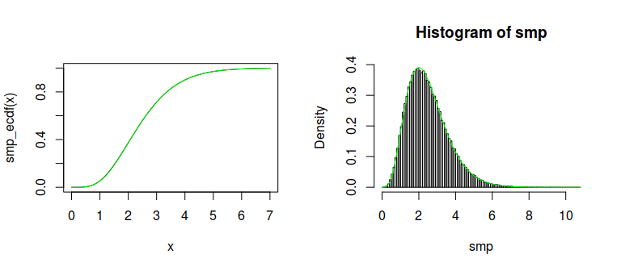

SCMC - Stochastic Collocation Monte Carlo
================

This is a development version of the `scmc` package for the R
programming language.

## Installation

The package isn’t available on CRAN so the only way to install the
package is to use the `devtools` package and run

``` r
devtools::install_github("blaza/scmc")
```

## Usage

The main function currently implemented is `univariate_sampler` which is
a flexible implementation of the method (and thus with a bit more
complicated interface) for generating univariate distributions. We’ll
cover here a couple of basic examples which give an overall picture of
the package capabilities.

### Example: Logistic distribution

We’ll generate variates from the [Logistic
distribution](https://en.wikipedia.org/wiki/Logistic_distribution).

The SCMC method implies interpolating $F_Y^{-1}(F_X(x))$, where $Y$
is the target random variable and $X$ is a random variable which can
be efficiently generated, and generating the samples
$y_i,\ i=1,\dots,n$ using the formula $y_i = F_Y^{-1}(F_X(\xi_i))$,
where $\xi_i$ are variates from the $X$ distribution. In this
example we’ll use the standard normal variable $X$. By default, we use
the `RcppZiggurat::zrnorm` function to generate normal variates.

The code to generate the Logistic distribution in the `scmc` package is

``` r
library(scmc)
# create the sampler
sampler <- univariate_sampler(qlogis, gaussian_nodes(7))
```

    ## Loading required package: RcppZiggurat

``` r
# generate 10000 random variates
smp <- sampler(1e5)
```

In its basic form, the `univariate_sampler` function requires the
inverse $F_Y^{-1}$ (i.e. the quantile function of $Y$) as the first
argument, and the nodes for the interpolation. In cases where normally
distributed $X$ are used, optimal nodes for interpolation are the
nodes of the Gaussian quadrature with respect to the weight function
$f_X(x)$ (density of $X$). The third argument to
`univariate_sampler` is `xdist` which is by default `"norm"`, indicating
the standard normal distribution.

The quality of the generated sample can be visualized with it’s density

``` r
# plot the sample density
plot(density(smp))

# add a plot of the theoretical logistic density
curve(dlogis(x), add = TRUE, col = "green")
```

<!-- -->

The curves are nearly the same, so the approximation is good.

### Example: Gamma distribution

For the next example, we’ll use the $\Gamma(5,2)$ distribution. This
is a positive distribution, so we would like to transform it using the
`log` transform to get a real variable and then upon sampling use the
`exp` transform to get a sample from the original distribution. The code
example follows

``` r
library(scmc)
# create the sampler
sampler <- univariate_sampler(function(x) qgamma(x, 5, 2),
                              gaussian_nodes(7),
                              transform = log, # the transformation of
                                               # the quantile function
                              inv_transform = exp) # the inverse of transform

# generate 10000 random variates
smp <- sampler(1e5)
```

``` r
smp_ecdf <- ecdf(smp)
curve(smp_ecdf(x), xlim = c(0, 10))
curve(pgamma(x, 5, 2), add = TRUE, col = "green")
```

<!-- -->

Again, the approximation is excellent.
